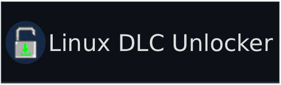
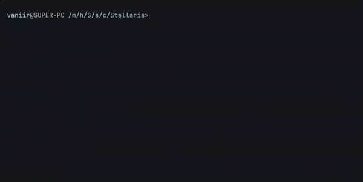

[](https://pypi.org/project/ldu-tool) [](https://www.python.org/) [](LICENSE)

⚡ Automatic unlocking of all DLCs for Stellaris on Linux (Steam) without any extra hassle.

## 📖 About the Project
`ldu-tool` is a Python utility that fully automates the process of connecting official Stellaris content in the Linux version of the game. Instead of manually searching for archives, editing configs, and setting up an API emulator, the script does everything itself:
- 📥 Downloads the latest DLCs
- 🔧 Embeds the latest version of the Steam API emulator (Goldberg)
- 📋 Generates correct configs for all add-ons to work
- 🧹 Removes temporary `.zip` files after installation

⚠️ **Important:** The tool works **only on Linux**. Use it at your own risk.



## 🚀 Quick Start

### 📦 Installation in 2 commands (recommended method)
1. Install the utility via `pipx`. This command will download and isolate the package in your user environment without affecting system Python libraries:
```bash
pipx install ldu-tool
```

2. Check that the installation was successful. This command will display the current version of the utility if everything went well:
```bash
ldu-tool --version
```

If `pipx` is not yet installed (for example, on Arch Linux), install it using the package manager. This command will download and install pipx from the official distribution repositories:
```bash
sudo pacman -S python-pipx
```


### 💻 Alternative installation (from source):
1. Clone this repository to a convenient location
```bash
git clone https://github.com/IAMVanilka/linux-dlc-unlocker-tool
```
2. Navigate to the repository folder
```bash
cd linux-dlc-unlocker-tool
```
3. Create a virtual environment (*requires **python-env***)
```bash
python -m venv .venv
```
4. Activate the environment
```bash
source venv/bin/activate
OR
source venv/bin/activate.fish # If you use fish instead of bash
```
5. Install dependencies
```bash
pip install -r requirements.txt
```
6. Check that the utility works
```bash
python -m modules.main --version
```
If the utility version is displayed, then you have done everything correctly!


### 🛠️ Usage
After installation, the tool is ready to work. Launch the basic installation in the current directory. The script will automatically find the game, download the DLCs, and configure the emulator:
```bash
ldu-tool install
```
Installation in a specific folder. This command will start the process at the specified path to the Stellaris root directory:
```bash
ldu-tool install --path /path/to/Stellaris
```


## ⚙️ Command List
|Command|Purpose  |
|--|--|
|**Basic**|--|
| `ldu-tool -V/--version`| Display the tool version|
| `ldu-tool -h/--help` / `ldu-tool install -h/--help` | Display command help|
|**Install**|
| `ldu-tool install` / `ldu-tool install <game_name>` | Launches the basic installation in the directory where the script is located. Downloads DLCs and the modified `libsteam_api.so` library |
|`ldu-tool install --path/-p <PATH_TO_GAME>`|Launches the basic installation at the specified path. Downloads DLCs and the modified `libsteam_api.so` library|
|`ldu-tool install --dlc`|Downloads **only DLCs** from the remote server|
|`ldu-tool install --libs/-l`|Downloads **only `libsteam_api.so`** from the remote server|
|`ldu-tool install --force/-f`|Downloads and unpacks DLCs even if they are already installed|
|`ldu-tool install --mods/-m`|Mounts the **Steam Workshop** folder into the mods directory.|
|**List**|
|`ldu-tool list`|Displays games available for unlocking|

## 🔍 How Does It Work?

1.  **Directory Check:** The script looks for the `stellaris` binary file in the specified folder. If it is not found, it asks the user for confirmation.
2.  **API Emulator:** Downloads a fresh build of `libsteam_api.so` from the **[GitLab repository fork of Goldberg Emulator](https://github.com/Detanup01/gbe_fork)** and places it in the game root.
3.  **DLC Configuration:** Creates a `steam_settings/` folder and a `configs.app.ini` file, filling it with `dlc_id:name` for all official DLCs via the public API `api.steamcmd.net`.
4.  **Content Download:** Downloads ZIP archives with DLC files from an external file server**.
5.  **Unpacking:** Extracts the contents of the archives into the `dlc/` folder and automatically deletes the original `.zip` files.
6.  **Launch (optional):** After installation, it offers to launch the game via Steam.

## 📂 File Structure After Installation
```
/path/to/Stellaris/
├── stellaris              # Main game executable
├── libsteam_api.so        # Steam API emulator (Goldberg)
├── steam_settings/
│   └── steam_appid.txt
        configs.app.ini    # Emulator settings and information about all DLCs
└── dlc/                   # Unpacked DLC content files
```

## ❓ Troubleshooting

-   **Connection error to `api.steamcmd.net`:** Try using a VPN or proxy if you are in a region with access restrictions.
-   **`PermissionError` when creating folders:** Make sure your user has write permissions to the game folder. Do not run the script via `sudo`; it is better to change the folder owner via `chown -R $USER:$USER /path/to/Stellaris` (recursively changes the owner of the folder and all its nested files to the current user).
-   **Game does not see DLCs:** Check that `libsteam_api.so` is in the same directory as the `stellaris` binary, and that the `dlc/` folder contains unpacked files, not archives. Check the `steam_settings/configs.app.ini` file. It should contain an `[app::dlcs]` section with all DLCs in the format `dlc_id = dlc_name`. If everything seems OK and nothing works, open an [issue](https://github.com/IAMVanilka/linux-dlc-unlocker-tool/issues/new) and we will discuss the issue).
- **Lost saves:** When using the modified `libsteam_api.so` library, you will have to give up **Steam Cloud Saves**, as the library intercepts all requests to the **steam api**. **Game saves are written to the directory:** `~/.local/share/Paradox Interactive/Stellaris/save games/`. If you need to transfer saves to another device, you will have to do it manually (***like a true pirate!***).


## 🤝 Support and Development
Found a bug, want to suggest an improvement, or add support for another game? Create an **[Issue](https://github.com/IAMVanilka/linux-dlc-unlocker-tool/issues/new)** or send a Pull Request.
The project is distributed "as is" and was created for educational purposes.


## 📜 License

This project is distributed **"as is"**. The author is not responsible for any possible consequences of using the utility. Use it at your own risk.
